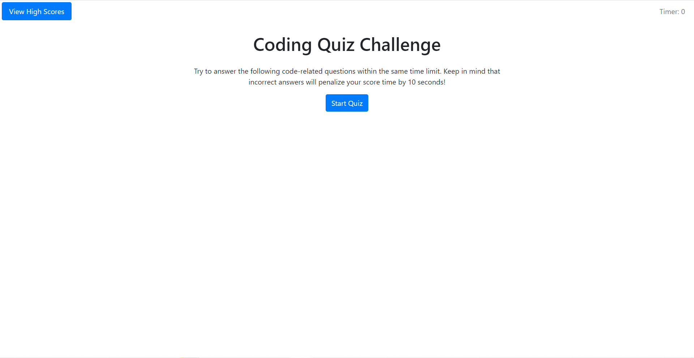
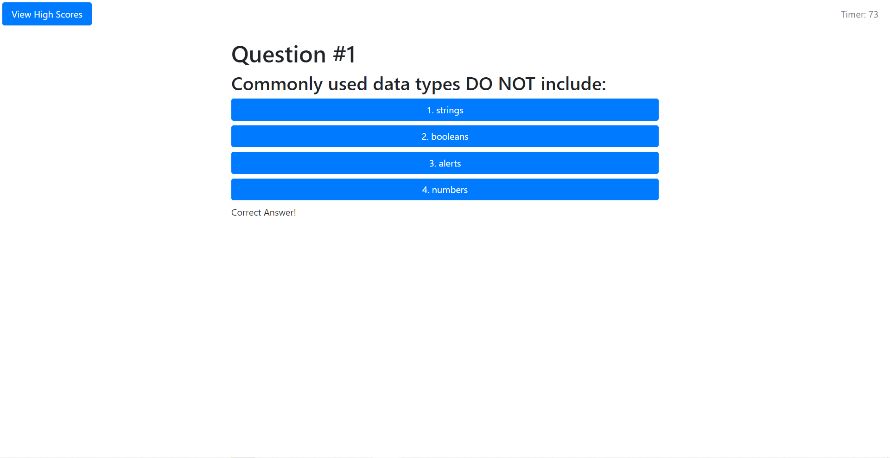
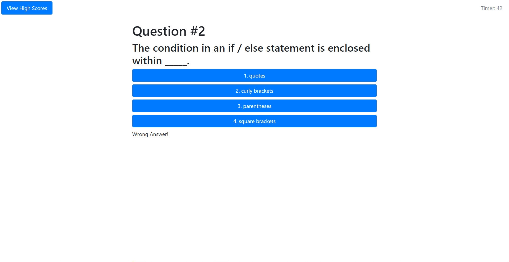
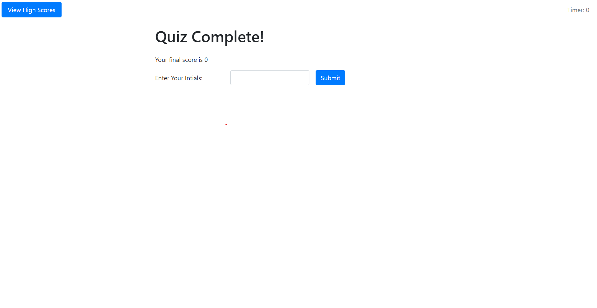
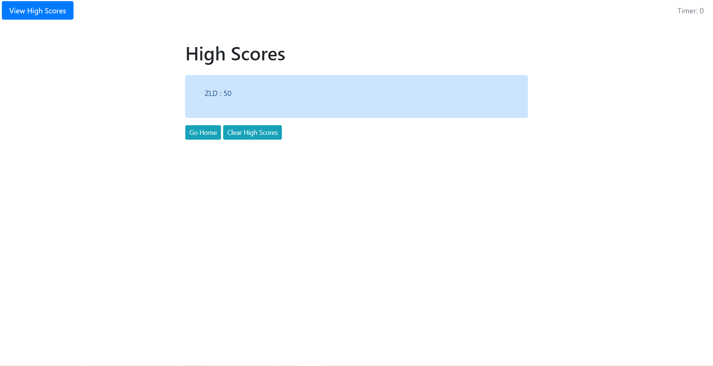

# code-quiz

## Table of Contents
* [Description](#Description)
* [Links](#Links)
* [Design Elements](#Design-Elements)
* [App Preview](#App-Preview)
* [Credits](#Credits)

## Description
This is an app that creates a timed, multiple-choice quiz about coding. Students and Experts alike can test their knowledge on JavaScript fundamentals and share their high score with their peers.

This app was designed using dynamically updated HTML and CSS powered by JavaScript and Bootstrap.

## Links
* Website: https://zachdrummond.github.io/code-quiz/?#
* GitHub Repository: https://github.com/zachdrummond/code-quiz

## Design Elements
### *JavaScript*
* Clean User Interface
* Dynamically Updated HTML and CSS
* Logical Code Structure
* Sequential Order
* Web Application Programming Interface
* Document Object Model Manipulation
* Local Storage
* Objects
* Arrays
* Methods
* Global and Local Variables
* Functions
* Event Listeners
* Interval
* if...else Statements
* for Loops
* Comments

### *Bootstrap*
* Grid System
* Navigation Bar with Button
* Form
* Spacing
* Colors

### *HTML*
* Logical Structure
* Sequential Order
* Bootstrap CSS Link
* CSS File Link
* JavaScript File Link
* Concise Descriptive Title
* Semantic Elements
* ids, Classes, and Elements
* Buttons
* Accessible Attributes
* Comments

## App Preview
### *Home Screen*

### *Question #1*

### *Question #2*

### *Quiz Complete Screen*

### *High Score Screen*

## Credits
* Bootstrap: https://getbootstrap.com/